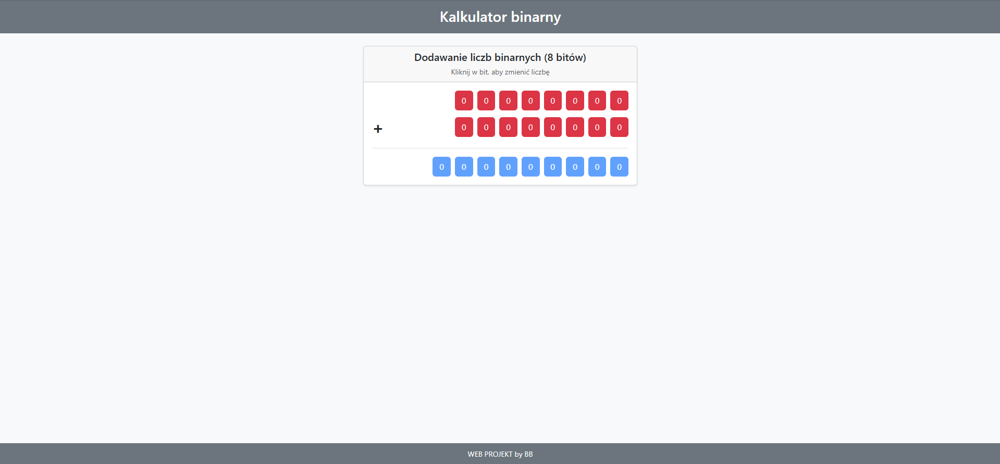

# 🧮 Kalkulator Binarny (8-bit)

Interaktywny kalkulator binarny umożliwiający dodawanie dwóch liczb zapisanych w systemie binarnym (8-bitowym).  
Aplikacja działa w przeglądarce i pozwala zmieniać wartość każdego bitu poprzez kliknięcie.

---

## 📌 Opis projektu

Projekt został wykonany w celu utrwalenia wiedzy z zakresu:

- systemów liczbowych
- działań na liczbach binarnych
- logiki programowania
- manipulacji elementami DOM w JavaScript

Użytkownik może ustawić dwie liczby binarne (8-bitowe), a aplikacja automatycznie oblicza i wyświetla wynik dodawania.

---

## ⚙️ Funkcjonalności

- ✅ Dodawanie dwóch liczb binarnych (8 bitów)
- ✅ Interaktywna zmiana bitów (0 ↔ 1)
- ✅ Automatyczne przeliczanie wyniku
- ✅ Wyświetlanie wyniku w postaci binarnej
- ✅ Czytelny i prosty interfejs

---

## 🛠️ Technologie

- HTML5  
- CSS3  
- JavaScript  

---

## ▶️ Jak uruchomić projekt

1. Sklonuj repozytorium:

```
git clone https://github.com/BartBak1507/Kalkulator-Binarny-8bit.git
```

2. Otwórz plik `index.html` w przeglądarce.

Projekt nie wymaga instalacji ani dodatkowych narzędzi.

---

## 📷 Podgląd aplikacji



---

## 🧠 Jak działa aplikacja?

1. Użytkownik klika wybrane bity (0 zmienia się na 1 i odwrotnie)
2. Program odczytuje wartości bitów
3. Liczby binarne są konwertowane na system dziesiętny
4. Wykonywane jest dodawanie
5. Wynik konwertowany jest ponownie na system binarny
6. Wynik wyświetlany jest jako liczba 8-bitowa

---

## 📂 Struktura projektu

```
Kalkulator-Binarny-8bit/
│
├── index.html
├── style.css
├── script.js
├── screenshot.png
└── README.md
```

---

## 🚀 Możliwe ulepszenia

- Obsługa odejmowania
- Obsługa mnożenia
- Obsługa systemu szesnastkowego
- Historia działań
- Wykrywanie przepełnienia (overflow)
- Wersja responsywna (mobile)

---

## 👨‍💻 Autor

Bartosz Bąk  
GitHub: https://github.com/BartBak1507
